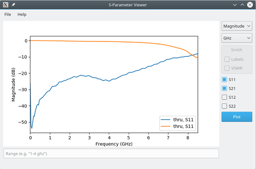

========
s2p-view
========

------------------
S-Parameter Viewer
------------------
License: `GPL-3.0-or-later <COPYING>`_

View and plot 1 or 2-port S-parameter (Touchstone) files

Dependencies
============
Python 3, matplotlib (Qt5Agg backend), pyqt5 (gui, widgets), scikit-rf

If you are building from source, you also need:

- make
- pyuic5

Building
========
::

  $ make

Usage
=====
::

  $ ./s2p-view [FILE]

To install the MIME file type description and desktop icon for SnP files::

  $ make desktop
